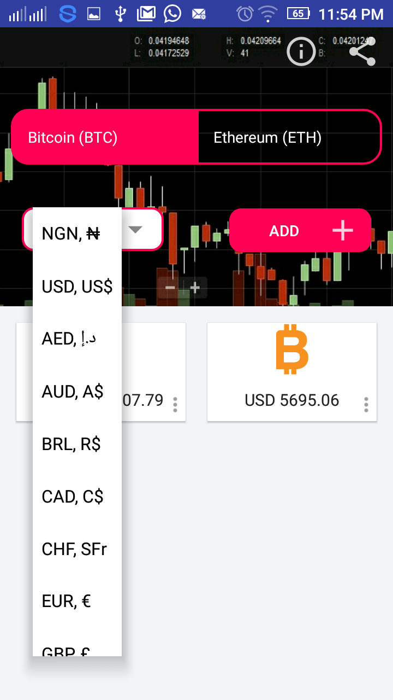
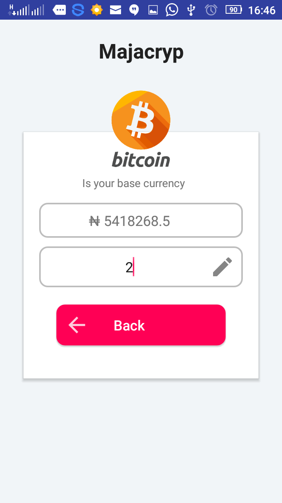
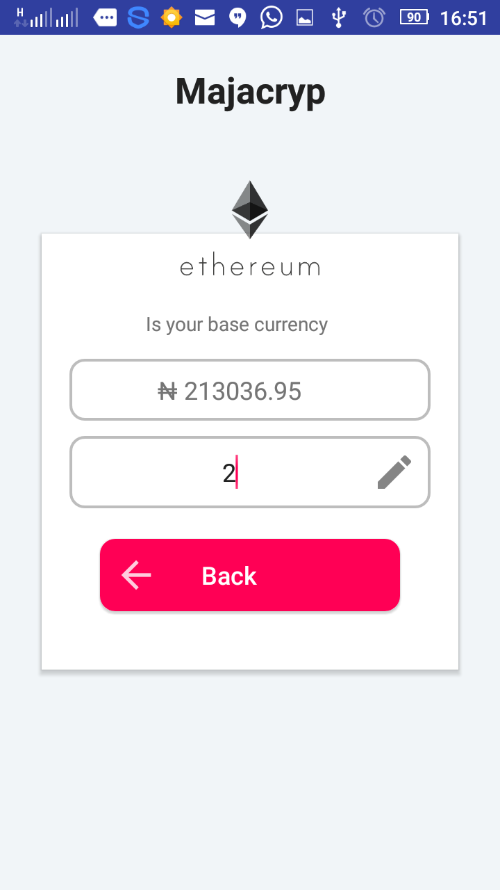
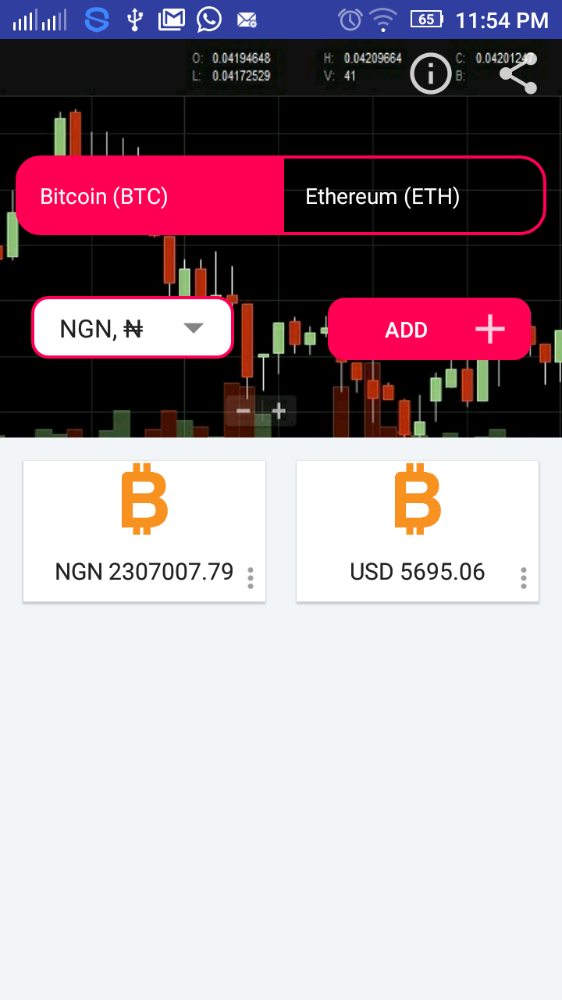

# Majacryp

Its a real time cryptocurrency calculator showing the latest exchange rate of BTC and ETH with actual rate in 20 major world currencies including Naira.
It uses the crypyocompare public api found [here](https://www.cryptocompare.com/) to get the to get the latest exchange rate. 
Users can create cards on the application screen to show the exchange rate between cryptocurrency and any of 20 major world 
currency including Naira. Clicking each card should take you to conversion screen. User can enter an amount to be converted in a base currency
User should get conversion result.

# Classes
This project have 5 java classes
1. AboutActivity
2. HomeActivity
3. ConversionActivity
4. Currency
5. CurrencyAdapter 

# Layouts
This project have 7  major Layouts
1. About Layout
2. Home Layout
3. Conversion Layout
4. Currency Layout
5. Layer Hint Layout
6. Home Content Layout
7. Currency Card Layout

# Click on Google Drive Icon Below to download apk

# Screenshots
&nbsp;
&nbsp;
&nbsp;
&nbsp;

# Author : Alabi Temitope 
