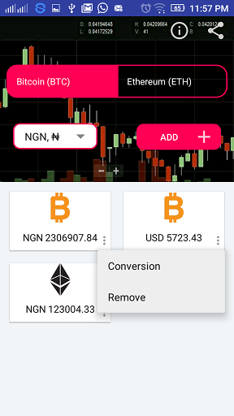

# Majacryp

This is a simple android application showing the latest exchange rate between cryptocurrencies BTC and ETH and 20 major world currencies including Naira.
It uses the crypyocompare public api found [here](https://www.cryptocompare.com/) to get the to get the latest exchange rate. 
Users can create cards on the application screen to show the exchange rate between cryptocurrency and any of 20 major world 
currency including Naira. Clicking each card should take you to conversion screen. User can enter an amount to be converted in a base currency
User should get conversion result.

# Classes
This project has 5 java classes
1. AboutActivity
2. HomeActivity
3. ConversionActivity
4. Currency
5. CurrencyAdapter 

# Screen Shots

# Author : Alabi Temitope 
